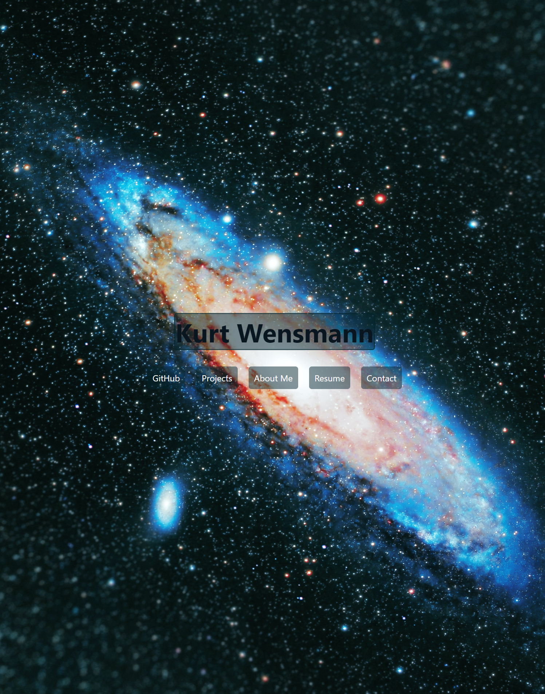

# Advanced CSS - Create Portfolio Webpage

## Webpage

* Name is displayed prominently
* Include navigation links to sections of the page
* Webpage is accesible across multiple screen sizes

## Projects Page

* Separate projects into individual sections/cards
* Each Card has background image and is clickable to anchored link
* First projects is Larger than the following

## Contact section

* Email is clickable and brings you to your email
* Contain Links to social media accounts

## About me sections

* Contains a paragraph introducing me 

## Inspirations

* https://portfolio-n4sn.vercel.app/#about
* https://www.adamalston.com/

## Image credits
Photo by <a href="https://unsplash.com/@jeremythomasphoto?utm_source=unsplash&utm_medium=referral&utm_content=creditCopyText">Jeremy Thomas</a> on <a href="https://unsplash.com/photos/E0AHdsENmDg?utm_source=unsplash&utm_medium=referral&utm_content=creditCopyText">Unsplash</a>
  

Photo by <a href="https://unsplash.com/@jeremythomasphoto?utm_source=unsplash&utm_medium=referral&utm_content=creditCopyText">Jeremy Thomas</a> on <a href="https://unsplash.com/photos/E0AHdsENmDg?utm_source=unsplash&utm_medium=referral&utm_content=creditCopyText">Unsplash</a>
  

Photo by <a href="https://unsplash.com/@tengyart?utm_source=unsplash&utm_medium=referral&utm_content=creditCopyText">Tengyart</a> on <a href="https://unsplash.com/photos/PmnCG7_2Sc4?utm_source=unsplash&utm_medium=referral&utm_content=creditCopyText">Unsplash</a>
  
* 010_crab_nebula-1024x1024
* * HUBBLE’S TOP 100 • #10 • Credit: NASA, ESA and Allison Loll/Jeff Hester (Arizona State University)